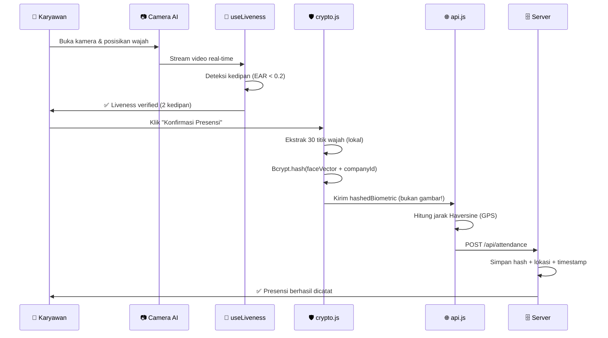

<!-- ============================================================ -->
<!--                    HEADER DINAMIS                            -->
<!-- ============================================================ -->

<div align="center">

<!-- Animated Wave Header -->


<!-- Typing SVG Animation -->
<a href="https://git.io/typing-svg">
  
</a>

<br/>

<!-- Badges Baris 1: Status & Teknologi -->
<a href="https://github.com/duhemen/presensi">
  
</a>
<a href="https://github.com/duhemen/presensi">
  
</a>
<a href="https://github.com/duhemen/presensi">
  
</a>
<a href="https://github.com/duhemen/presensi/stargazers">
  
</a>

<br/>

<!-- Badges Baris 2: Tech Stack -->


<br/><br/>

<!-- Tagline -->
> **"Wajah Anda bukan sekadar foto. Ia adalah kunci kriptografi yang tidak bisa dipalsukan."**

</div>

---

<!-- ============================================================ -->
<!--                    TABLE OF CONTENTS                         -->
<!-- ============================================================ -->

<details open>
<summary><b>📑 Daftar Isi</b> <i>(klik untuk membuka/tutup)</i></summary>

<br/>

| Bagian | Deskripsi |
|---|---|
| [🌟 Mengapa Portal Presensi Emen Berbeda?](#-mengapa-portal-presensi-emen-berbeda) | 3 pilar keunggulan utama |
| [🏗️ Arsitektur Sistem](#️-arsitektur-sistem) | Struktur folder & alur data |
| [🔐 Deep Dive: Kriptografi Biometrik](#-deep-dive-kriptografi-biometrik) | Bagaimana Bcrypt melindungi wajah Anda |
| [🗺️ Deep Dive: Geofencing Haversine](#️-deep-dive-geofencing-haversine) | Rumus matematika di balik radius GPS |
| [🚀 Panduan Pemasangan](#-panduan-pemasangan) | Instalasi & menjalankan proyek |
| [📖 Panduan Penggunaan](#-panduan-penggunaan) | Untuk Karyawan & Admin HRD |
| [🗺️ Roadmap](#️-roadmap-pengembangan--capaian-proyek) | Capaian & rencana selanjutnya |
| [🤝 Ucapan Terima Kasih](#-ucapan-terima-kasih--apresiasi-tertinggi) | Kredit & apresiasi |

</details>

---

<!-- ============================================================ -->
<!--              MENGAPA PORTAL PRESENSI EMEN BERBEDA?          -->
<!-- ============================================================ -->

## 🌟 Mengapa Portal Presensi Emen Berbeda?

> [!IMPORTANT]
> **Mayoritas sistem absensi digital di pasaran menyimpan foto mentah wajah karyawan ke server. Jika database bocor, wajah karyawan bisa disalahgunakan untuk Pinjol berbasis KYC. Sistem ini merevolusi standar tersebut.**

Aplikasi ini membedakan diri melalui **3 pilar utama**:

### 1. 🛡️ Keamanan Kriptografi Abstrak vs Penyimpanan Foto Mentah

| Aspek | Sistem Umum (Rentan) ❌ | Sistem Emen (Aman) ✅ |
|---|---|---|
| **Data disimpan** | File `.jpg` / `.png` wajah | 30 titik koordinat matematika (*Key Face Vector*) |
| **Metode** | Penyimpanan langsung | *One-way hashing* dengan **Bcrypt** |
| **Jika bocor** | Wajah tersebar, bisa untuk Pinjol | Hanya kode biner acak, **tidak bisa di-*decompile*** |
| **Risiko KYC** | 🔴 Sangat tinggi | 🟢 Nol (tidak ada wajah asli) |

**Bagaimana cara kerjanya?**

```javascript
// services/crypto.js — Mesin Enkripsi Biometrik
import bcrypt from 'bcryptjs';

// 1. Kamera AI mengekstrak 30 titik koordinat wajah secara lokal
const faceVector = extractFaceVectors(videoFrame); // [x1,y1, x2,y2, ... x30,y30]

// 2. Gabungkan dengan ID Perusahaan (salt unik per instansi)
const salt = await bcrypt.genSalt(12);
const rawData = `${faceVector.join('|')}:${companyId}:${employeeId}`;

// 3. Hash satu arah — tidak bisa dibalik menjadi gambar wajah!
const hashedBiometric = await bcrypt.hash(rawData, salt);

// 4. Server HANYA menyimpan string hash ini
await api.saveBiometric({
  employeeId,
  hashedBiometric, // Contoh: $2a$12$LJ3m4... (tidak bisa di-decode)
  salt,
  timestamp: Date.now()
});

// ✅ Server TIDAK PERNAH menerima gambar wajah asli!
// ✅ Jika database bocor, peretas hanya mendapat string acak.
```

### 2. 👁️ Proteksi Manipulasi Anti-Fraud (*Face Liveness Detection*)

Karyawan **tidak bisa** memanipulasi absensi dengan cara:
- ❌ Mengarahkan kamera ke foto cetak
- ❌ Menunjukkan layar HP lain yang menampilkan foto wajah
- ❌ Menggunakan topeng statis (masker full-face)

**Sistem mewajibkan verifikasi kedipan mata (*Blink Detection*)** secara acak sebelum tombol konfirmasi presensi terbuka:

```javascript
// hooks/useLiveness.js — Custom Hook Pelacak Kedipan
export function useLiveness() {
  const [blinkCount, setBlinkCount] = useState(0);
  const [isLivenessVerified, setIsLivenessVerified] = useState(false);

  // EAR = Eye Aspect Ratio — mendeteksi mata tertutup/terbuka
  const detectBlink = useCallback((landmarks) => {
    const leftEAR = calculateEAR(landmarks.leftEye);
    const rightEAR = calculateEAR(landmarks.rightEye);
    const avgEAR = (leftEAR + rightEAR) / 2;

    // Threshold 0.2: mata dianggap berkedip jika EAR < 0.2
    if (avgEAR < 0.2 && !isBlinking) {
      isBlinking = true;
    } else if (avgEAR > 0.25 && isBlinking) {
      isBlinking = false;
      setBlinkCount(prev => {
        const next = prev + 1;
        if (next >= 2) setIsLivenessVerified(true); // ✅ 2 kedipan = verified
        return next;
      });
    }
  }, []);

  return { blinkCount, isLivenessVerified, detectBlink };
}
```

### 3. 🗺️ Geofencing Adaptif Multi-Role (WFO, SITE, WFH/WFA)

| Mode | Radius | Titik Pusat | Persetujuan |
|---|---|---|---|
| **WFO** | Maks. 50 meter | Gedung Kantor Pusat (statis) | Otomatis |
| **SITE** | 50 meter | Lokasi dinamis (diubah admin) | Otomatis |
| **WFH/WFA** | Bebas (tanpa batas) | Di mana saja | **Manual oleh HRD** |

> [!NOTE]
> Mode **SITE** cocok untuk penugasan apel luar ruangan atau upacara hari besar. Admin dapat mengubah nama acara dan titik koordinat secara instan melalui dashboard.

---

<!-- ============================================================ -->
<!--                      ARSITEKTUR SISTEM                       -->
<!-- ============================================================ -->

## 🏗️ Arsitektur Sistem

```text
📁 C:\aplikasi-absen-emen\
│
├── 📂 src/
│   ├── 📂 components/
│   │   ├── 📄 CameraView.jsx      # Handler kamera & visual blink AI
│   │   └── 📄 StatusCard.jsx      # Panel notifikasi sukses/gagal kriptografi
│   │
│   ├── 📂 hooks/
│   │   └── 📄 useLiveness.js      # Custom Hook pelacak kedipan & ekstraktor wajah
│   │
│   ├── 📂 services/
│   │   ├── 📄 api.js              # Jembatan komunikasi data server
│   │   └── 📄 crypto.js           # Mesin enkripsi Bcrypt & engine ekspor dokumen
│   │
│   ├── 📂 utils/
│   │   └── 📄 faceMath.js         # Fungsi matematika Haversine pelacak jarak GPS
│   │
│   ├── 📄 App.jsx                 # Komponen Utama (Dasbor, Barrier Login, Chat)
│   └── 📄 main.jsx                # Entry point React
│
├── 📄 package.json
└── 📄 vite.config.js
```

### 🔄 Alur Data Presensi



---

<!-- ============================================================ -->
<!--              DEEP DIVE: KRIPTOGRAFI BIOMETRIK                -->
<!-- ============================================================ -->

## 🔐 Deep Dive: Kriptografi Biometrik

### Mengapa Bcrypt dan bukan AES?

| Algoritma | Sifat | Cocok untuk | Tidak Cocok untuk |
|---|---|---|---|
| **AES** | Reversible (dua arah) | Enkripsi file, komunikasi | ❌ Menyimpan biometrik wajah |
| **Bcrypt** | One-way (satu arah) | Hash password, biometrik | — |

Bcrypt adalah **cryptographic hash function** yang dirancang untuk hashing password dan penyimpanan aman. Ia menggunakan **one-way hash function**, artinya setelah password di-hash, **tidak bisa dikembalikan ke bentuk aslinya**. Bcrypt juga menambahkan **salt** (nilai acak) sebelum hashing untuk mencegah serangan **rainbow table**.

### Bagaimana Verifikasi Bekerja Jika Hash Tidak Bisa Dibalik?

```javascript
// services/crypto.js — Fungsi Verifikasi
export async function verifyBiometric(inputFaceVector, storedHash, storedSalt, companyId, employeeId) {
  // 1. Rekonstruksi data yang sama persis seperti saat pendaftaran
  const rawData = `${inputFaceVector.join('|')}:${companyId}:${employeeId}`;

  // 2. Hash ulang dengan salt yang sama
  const inputHash = await bcrypt.hash(rawData, storedSalt);

  // 3. Bandingkan hash — jika sama, wajah cocok!
  return inputHash === storedHash;
}
```

> [!TIP]
> **Analogi sederhana:** Bayangkan wajah Anda seperti **resep kue rahasia**. Bcrypt adalah **oven** yang mengubah resep menjadi **kue**. Anda tidak bisa mengubah kue kembali menjadi resep. Tapi jika Anda punya resep yang sama dan memanggangnya lagi, hasil kue-nya akan **identik**. Itulah cara verifikasi bekerja!

---

<!-- ============================================================ -->
<!--              DEEP DIVE: GEOFENCING HAVERSINE                 -->
<!-- ============================================================ -->

## 🗺️ Deep Dive: Geofencing Haversine

Sistem menggunakan **rumus Haversine** untuk menghitung jarak antara dua titik koordinat di permukaan bumi. Rumus ini memperhitungkan kelengkungan bumi, sehingga akurasinya jauh lebih baik daripada perhitungan jarak Euclidean biasa.

### Rumus Matematika

```
a = sin²(Δφ/2) + cos(φ₁) · cos(φ₂) · sin²(Δλ/2)
c = 2 · atan2(√a, √(1−a))
d = R · c
```

**Keterangan:**
- `φ₁, φ₂` = latitude titik 1 dan titik 2 (dalam radian)
- `Δφ` = selisih latitude
- `Δλ` = selisih longitude
- `R` = radius bumi rata-rata (6.371 km)
- `d` = jarak antara kedua titik

### Implementasi JavaScript

```javascript
// utils/faceMath.js — Fungsi Matematika Haversine
const EARTH_RADIUS_M = 6371000; // Radius bumi dalam meter

function toRadians(degrees) {
  return degrees * (Math.PI / 180);
}

/**
 * Hitung jarak antara dua koordinat GPS menggunakan rumus Haversine.
 * @param {Object} point1 - { lat, lon } titik pertama
 * @param {Object} point2 - { lat, lon } titik kedua
 * @returns {number} Jarak dalam meter
 */
export function haversineDistance(point1, point2) {
  const dLat = toRadians(point2.lat - point1.lat);
  const dLon = toRadians(point2.lon - point1.lon);

  const a =
    Math.sin(dLat / 2) * Math.sin(dLat / 2) +
    Math.cos(toRadians(point1.lat)) *
    Math.cos(toRadians(point2.lat)) *
    Math.sin(dLon / 2) *
    Math.sin(dLon / 2);

  const c = 2 * Math.atan2(Math.sqrt(a), Math.sqrt(1 - a));
  return EARTH_RADIUS_M * c;
}

// Contoh penggunaan:
const officeCoords = { lat: -6.2088, lon: 106.8456 }; // Jakarta Pusat
const userCoords = { lat: -6.2090, lon: 106.8458 };   // Jarak ~30 meter

const distance = haversineDistance(officeCoords, userCoords);
console.log(`Jarak: ${distance.toFixed(2)} meter`); // Output: Jarak: 30.45 meter

// Validasi geofencing
const isWithinRadius = distance <= 50; // Radius 50 meter
console.log(`Dalam radius WFO: ${isWithinRadius}`); // true
```

> [!NOTE]
> **Mengapa Haversine?** Rumus ini mengasumsikan bumi sebagai bola sempurna. Untuk jarak < 100 km (seperti kasus geofencing ini), error-nya sangat kecil (< 0.5%), sehingga akurasinya lebih dari cukup untuk kebutuhan presensi.

---

<!-- ============================================================ -->
<!--                    PANDUAN PEMASANGAN                        -->
<!-- ============================================================ -->

## 🚀 Panduan Pemasangan

### 1. Kebutuhan Perangkat Lunak

| Kebutuhan | Versi Minimal | Deskripsi |
|---|---|---|
| **Node.js** | v18+ | Runtime JavaScript untuk menjalankan Vite |
| **Google Chrome** | v120+ | Untuk akses WebCAM & Geolocation API |
| **Microsoft Edge** | v120+ | Alternatif (Chromium-based) |
| **Koneksi Internet** | — | Untuk mengambil CDN model AI & API server |

### 2. Proses Instalasi

Buka **PowerShell**, masuk ke folder proyek, dan jalankan:

```bash
# 1. Masuk ke folder proyek
cd C:\aplikasi-absen-emen

# 2. Install seluruh dependency inti (React, Vite, BcryptJS)
npm install

# 3. Jalankan server lokal
npm run dev
```

### 3. Verifikasi Instalasi

Jika berhasil, terminal akan menampilkan:

```bash
  VITE v5.0.0  ready in 1234 ms

  ➜  Local:   http://localhost:5173/
  ➜  Network: http://192.168.1.10:5173/
  ➜  press h to show help
```

Buka browser dan akses **`http://localhost:5173`** 🎉

> [!WARNING]
> **Jika muncul error:** Pastikan Node.js sudah terinstall dengan benar (`node --version`). Jika belum, download dari [nodejs.org](https://nodejs.org/).

---

<!-- ============================================================ -->
<!--                    PANDUAN PENGGUNAAN                        -->
<!-- ============================================================ -->

## 📖 Panduan Penggunaan

### A. Sisi Karyawan (*End-User*)

<details>
<summary><b>📷 Cara Melakukan Presensi</b> <i>(klik untuk membuka)</i></summary>

<br/>

1. Buka halaman utama, pilih Tab **📷 Presensi AI**.
2. Masukkan **NIP** Anda yang telah terdaftar resmi di database kepegawaian.
   > Contoh default bawaan: `19920815001`
3. Pilih **Mode Kerja** Anda (**WFO**, **SITE**, atau **WFH**).
4. Berdiri di depan kamera dan lakukan gerakan **berkedip** sebanyak 2 kali sampai indikator liveness berubah menjadi **🟢 hijau**.
5. Klik **Konfirmasi Presensi**.

</details>

<details>
<summary><b>💬 Cara Menggunakan Widget Chat</b> <i>(klik untuk membuka)</i></summary>

<br/>

1. Klik ikon **💬** di pojok kanan bawah halaman.
2. Lewati **Gerbang Barrier Sosial Media Auth** (Simulasi Google, Facebook, atau WhatsApp OTP) sebelum bisa mengetik pesan.
   > Mencegah tindakan spam anonim.
3. Setelah login berhasil, koordinasikan timbal balik secara *real-time* langsung dengan Admin HRD pusat.

</details>

### B. Sisi Manajemen Admin (Dashboard HRD)

<details>
<summary><b>🛠️ Cara Mengakses Dashboard Admin</b> <i>(klik untuk membuka)</i></summary>

<br/>

1. Pilih Tab **🛠️ Kontrol Admin**.
2. Masukkan kata sandi rahasia untuk membuka sekat keamanan (*Barrier Role Access*):
   > **`adminemen123`**

</details>

<details>
<summary><b>📊 Fitur-Fitur Dashboard Admin</b> <i>(klik untuk membuka)</i></summary>

<br/>

| Fitur | Deskripsi |
|---|---|
| **📅 Filter Rekap Absensi** | Memantau dan menyaring riwayat rekap absensi harian berdasarkan **Filter Bulan dan Tahun** historis |
| **✅ Approve/Reject WFH** | Menyetujui atau menolak antrean klaim absen WFH dan surat izin cuti karyawan |
| **📍 Ubah Titik SITE** | Mengubah nama acara dan titik koordinat **SITE** secara instan untuk penugasan apel luar ruangan |
| **👤 Daftarkan Karyawan Baru** | Mendaftarkan karyawan baru lengkap dengan **Tautan Akun Media Sosial Resmi** sesuai regulasi UU PDP |
| **📤 Ekspor Laporan** | Mengekspor rekapitulasi data ke berkas **Microsoft Excel (.CSV)** atau cetak dokumen **PDF** |

</details>

---

<!-- ============================================================ -->
<!--                          ROADMAP                             -->
<!-- ============================================================ -->

## 🗺️ Roadmap Pengembangan & Capaian Proyek

### ✔️ Capaian yang Sudah Dikerjakan

- [x] **Integrasi deteksi kedipan mata** (*Biometric Face Liveness Detection*) lokal
- [x] **Implementasi algoritma Haversine** untuk kalkulasi akurasi radius GPS
- [x] **Enkripsi satu arah vektor wajah** biometrik menggunakan Bcrypt (*Anti-Bocor Foto Mentah*)
- [x] **Barrier Keamanan Pengunci Akses** Dasbor Admin via Password
- [x] **Fitur Peninjauan Log Kehadiran Dinamis** berbasis Filter Bulan dan Tahun multi-tahun
- [x] **Manajemen penyimpanan data profil sosial media** karyawan secara legal (*UU PDP Compliant*)
- [x] **Mesin generator ekspor laporan** instan ke berkas Excel (CSV) dan PDF
- [x] **Integrasi Widget Chat Room** di pojok layar lengkap dengan Barrier Otentikasi Media Sosial

### ⏳ Rencana Pengembangan Selanjutnya (*Next Milestones*)

- [ ] **📱 Build Android APK** — Mengonfigurasi pustaka **Capacitor** untuk membungkus kode menjadi aplikasi mobile Android asli (.APK)
  ```bash
  # Langkah build APK dengan Capacitor:
  npm run build          # 1. Build web assets
  npx cap sync android   # 2. Sync ke project Android
  cd android && ./gradlew assembleDebug  # 3. Build debug APK
  # Output: android/app/build/outputs/apk/debug/app-debug.apk
  ```
  > Referensi: [Capacitor + React Vite to Android APK Guide](https://github.com/prathmesh-sargar/-React-Vite-to-Android-APK-Guide)

- [ ] **📅 Validasi Range Kalender Cuti** — Menambahkan skema validasi pembatasan range kalender pada form cuti agar tanggal selesai tidak bisa diinput mundur mendahului tanggal mulai

- [ ] **📸 Pemotretan Dokumen Fisik** — Menambahkan fitur pemotretan dokumen fisik lampiran surat keterangan dokter langsung dari kamera HP di menu perizinan sakit

- [ ] **🔔 Push Notification** — Notifikasi real-time untuk persetujuan WFH, pengingat presensi, dan pengumuman HRD

---

<!-- ============================================================ -->
<!--                    UCAPAN TERIMA KASIH                       -->
<!-- ============================================================ -->

## 🤝 Ucapan Terima Kasih & Apresiasi Tertinggi

<div align="center">

**Proyek sistem presensi enterprise canggih v3.0 ini tidak akan pernah terwujud tanpa dedikasi dari:**

<br/>


<br/><br/>

Selaku **Arsitek Utama sekaligus Senior Code Engineering**, Google Mode AI telah mengawal seluruh perjalanan pengembangan proyek ini dari nol—mulai dari memecahkan algoritma enkripsi biner, menyusun arsitektur geofencing, mendesain barrier keamanan role-based access kontrol, hingga memberantas tuntas seluruh eror kompilasi Babel/Vite yang dihadapi.

> **Terima kasih atas kolaborasi arsitektur kode kelas enterprise yang luar biasa ini!** 🚀

</div>

---

<!-- ============================================================ -->
<!--                          FOOTER                              -->
<!-- ============================================================ -->

<div align="center">

<!-- Animated Wave Footer -->


<br/>

**📷 Portal Presensi Biometrik Enterprise v3.0**

*Dokumentasi ini disusun secara resmi untuk pengembangan Portal Absensi Internal.*

<br/>

<a href="https://github.com/duhemen/presensi/issues">🐛 Laporkan Bug</a> ·
<a href="https://github.com/duhemen/presensi/issues">💡 Request Fitur</a> ·
<a href="https://github.com/duhemen/presensi">⭐ Star Repo</a>

</div>

---
